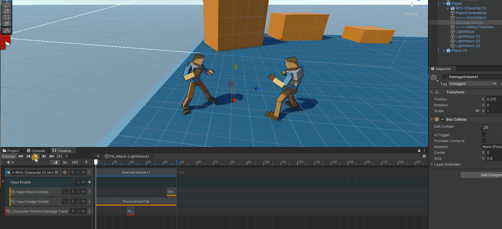
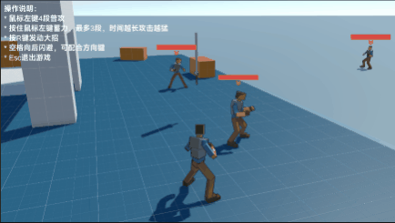
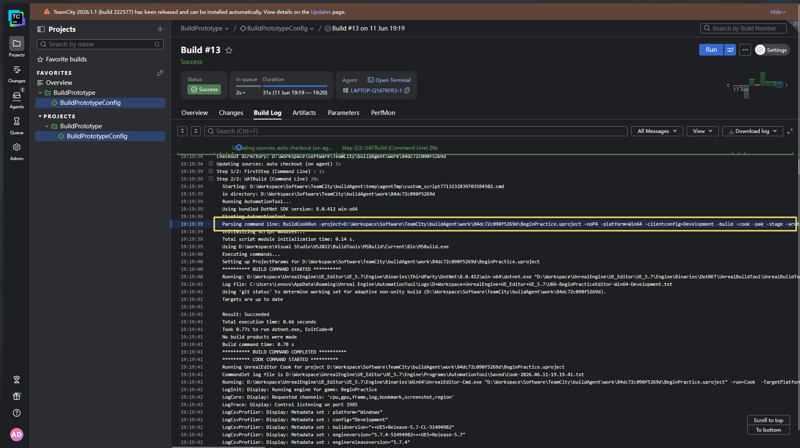
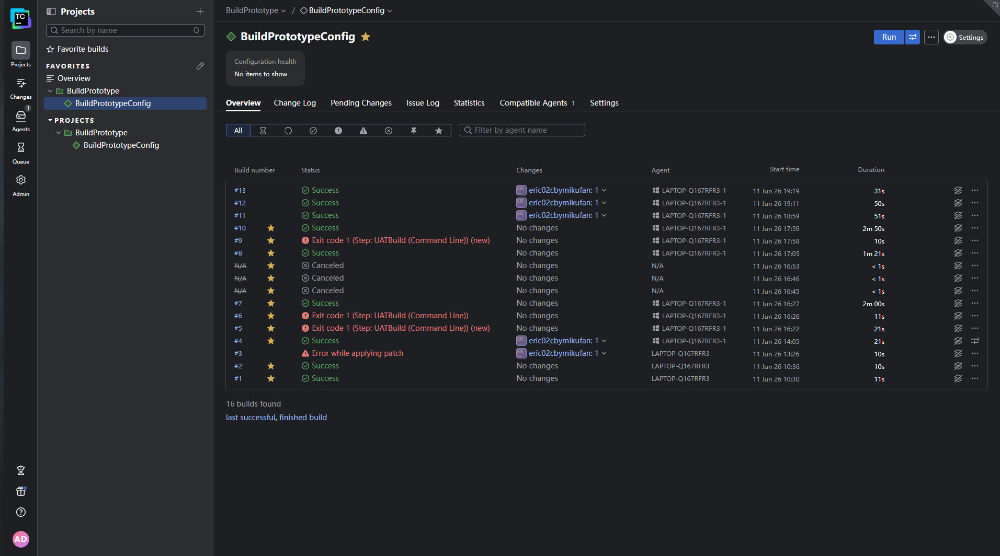

## Table of Contents

Unity / C#

- [同人TPS游戏《少前：攻性协议》](#同人游戏-少女前线攻性协议)
	- [载具和人形角色的混合战场](#载具和人形角色的混合战场)
    - [IK射击姿态控制](#ik射击姿态控制)
    - [手雷投掷瞄准](#手雷投掷瞄准)
    - [节点化关卡配置](#节点化关卡配置)
    - [支援面板](#支援面板)
	- [GAS-in-Unity](#GAS-in-Unity)
- [动作游戏战斗原型](#动作游戏战斗原型)
	- [基于Timeline的技能编辑器](#基于Timeline定制轨道的技能编辑器)
	- [战斗-连招和反馈](#战斗-连招和反馈)
	- [RootMotion物理兼容](#RootMotion物理兼容)
	- [终结技](#终结技)

Unreal Engine

- [UE-GAS练习](#UE-GAS练习)
- [UE-多人游戏练习](#UE-多人游戏练习)
- [UE-TeamCity-持续部署](#UE-TeamCity-持续部署)

---

（动态图加载可能需要耐心等待）

## 同人游戏-少女前线攻性协议

负责完成了游戏全部的程序框架，以及绝大多数具体程序功能。（基于Unity）

> 最新发布信息：
>
> （该项目为非商业化的少女前线同人游戏项目，下载游玩完全免费，无需捐赠等门槛，我是团队成员：`时源之元`，该项目后续更新发布交由`没头脑盒ZYC`进行）
> 
> [视频链接](https://www.bilibili.com/video/BV1ZePtzqEtF/)
>
> [下载地址 - 百度网盘](https://pan.baidu.com/s/1oYeQwKE7sQMnsGCOAKTt-A?pwd=GXXY) 提取码: GXXY

### 载具和人形角色的混合战场

载具能使用撞击破坏脆弱环境对象。

载具和人形角色有不同的活动区域，人形角色可以躲入室内，载具在追击时会尝试在最近的室外入口攻击。

合理的模型物理层级划分，人形可以从载具模型下的空间穿过，载具可正常在地面移动。

### IK射击姿态控制

高级IK绑定结构，支持左手持枪、右手持枪、双手持枪的切换，以及IK控制和动画控制的过渡

### 手雷投掷瞄准

基于物理抛物线计算弹道、碰撞点及反弹轨迹，手感对标《全境封锁》。

### 节点化关卡配置

基于Unity可视化编程制作的关卡配置节点工具，可快速搭建复杂关卡原型。支持的功能包括：角色生成、获取存活角色、按策略选择生成点、添加头顶标记（玩家引导）、添加互动点、设置AI活动限制区域（引导AI按剧本移动）等等

 

### 支援面板

使用统一的轮盘界面，允许配置多种类型的支援功能。
- 易于扩展，统一的模块入口方便从不同的代码注册支援功能
- 参数可选，能够接受位置信息或角色信息，并且可以限制只对敌方或友方触发

下方演示从左到右依次是：
召唤增援队友，指示队友攻击，呼叫空袭打击。

### GAS-in-Unity

借鉴了 Unreal Engine 的 GAS系统（Gameplay Ability System）设计思想，参考 GAS 使用文档制作而来的 Unity GAS。虽然不支持网络联机，功能上来说距离 UE GAS 有差距，不过在单机中已经能用一用了。

我在《少前：攻性协议》中制作的许多技能全都基于这套自制GAS，包括：

- 所有人形角色的投掷物技能
- 部分角色的双持攻击
- 爆头攻击恢复护盾等被动技能
- 受EMP攻击的角色硬直等强制行为
- ......

仓库链接：[GAS-in-Unity](https://github.com/eric02gamer/GameplayAbilitySystem-in-Unity)

---

## 动作游戏战斗原型

独立完成的动作游戏战斗原型，包含动作游戏常用技术点。
### 基于Timeline定制轨道的技能编辑器
基于Timeline定制轨道的技能编辑器，方便技能的配置和预览
- 伤害执行轨道
- 指令输入限制轨道

### 战斗-连招和反馈
- 玩家预输入缓冲，并在指令可用时按优先级读取输入指令，保证手感稳定流畅。
- 自动锁定附近敌人并在攻击时朝向敌人
- 连招搭配多种类型的角色受击反馈，**强化打击感**
- 基于[自制GAS](#GAS-in-Unity)的攻击伤害附加火焰点燃

### RootMotion物理兼容
代码拦截获取 `Animator` 的 RootMotion 动画位移，并驱动 `CharacterController.Move` ，实现动画位移和物理的兼容

### 终结技
综合编排技能的动作表演，相机切换，特效，伤害，点燃，敌方受击反馈整合而成的终结技演出。

---

## UE-GAS练习

在 UE（Unreal Engine）中使用GAS系统（Gameplay Ability System）复刻全境封锁2的芳心终结者装备组效果。充分使用到了 GAS 制作涉及复杂数值计算 RPG 游戏的强大功能。

（该项目基于 UE-First Person C++模板）

仓库链接：[ue-gas-practice](https://github.com/eric02gamer/ue-gas-practice)

---

## UE-多人游戏练习

可本地运行的多人射击游戏Demo，核心网络同步模块，重点解决“网络延迟导致攻击判定不准”这一核心体验问题，并提供了可交互的对比验证工具。

- 基于延迟补偿实现高精度射线命中判定，回溯到玩家开火瞬间的世界快照。
- 服务器持续记录并更新玩家世界快照，关键射线判定逻辑由服务器执行；
- 基于 NTP 思想的网络时间同步，多次采样取均值减弱网络波动影响（更严峻情况可能得考虑卡尔曼滤波等算法）
- 可打包专有服务器（Dedicated Server）并使用作弊码启用调试功能，验证补偿效果带来的实际体验提升

> 该部分预览图较大，请点击查看
> - [关闭服务器延时补偿](attachments/UE网络练习-关闭服务器延时补偿.gif)
> - [启用服务器延时补偿](attachments/UE网络练习-启用服务器延时补偿.gif)

---

## UE-TeamCity-持续部署

基于 TeamCity 的 UE 持续部署，使用 VCS Trigger，轮询检查 Github 仓库的变更，并自动在发生变更时编译并打包游戏到指定目录。用于自动化测试和保障游戏质量。使用 PostgreSQL 管理打包记录。

---
