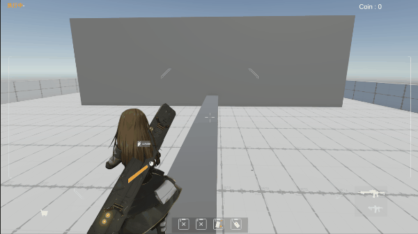
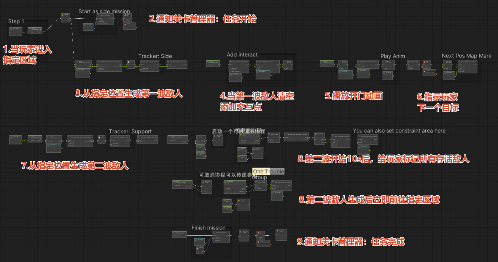

## Table of Contents

- [自我介绍](#自我介绍)
- [同人游戏《少前：攻性协议》](#同人游戏-少前-攻性协议)
	- [载具和人形角色的混合战场](#载具和人形角色的混合战场)
    - [IK射击姿态控制](#ik射击姿态控制)
    - [手雷投掷瞄准](#手雷投掷瞄准)
    - [节点化关卡配置](#节点化关卡配置)
- [GameplayAbilitySystem](#GameplayAbilitySystem)
	- [GAS-in-Unity](#GAS-in-Unity)

## 自我介绍

**你好！**

我是一个程序员，喜欢玩游戏，也喜欢研究游戏制作的各种技术和有趣的机制。熟悉Unity开发，也对Unreal Engine、Blender、Pytorch、Godot等技术工具也有所了解。不过我认为工具只是实现创意或者目标的手段，真正重要的还是对核心原理的理解和举一反三。

这是我的个人技术向作品集仓库，后续也会持续更新。如果有合作意向或者希望和我交流游戏创意、游戏开发技术等，欢迎通过以下方式联系我：

- 📺 B站：[@时源之元](https://space.bilibili.com/32729713)
- 📧 邮箱： eric01cbymikufan@outlook.com

---

## 同人游戏《少前：攻性协议》

负责完成了游戏全部的程序框架，以及多数具体程序功能。（基于Unity）

最新发布信息：

[视频链接](https://www.bilibili.com/video/BV1ZePtzqEtF/)（团队成员：时源之元）

### 载具和人形角色的混合战场

### IK射击姿态控制

高级IK绑定结构，支持左手持枪、右手持枪、双手持枪的切换，以及IK控制和动画控制的过渡

### 手雷投掷瞄准

基于物理抛物线计算弹道、碰撞点及反弹轨迹，手感对标《全境封锁》。

### 节点化关卡配置

基于Unity可视化编程制作的关卡配置节点工具，可快速搭建复杂关卡原型。支持的功能包括：角色生成、获取存活角色、按策略选择生成点、添加头顶标记（玩家引导）、添加互动点、设置AI活动限制区域（引导AI按剧本移动）等等

 

---

## GameplayAbilitySystem

### GAS-in-Unity

借鉴了 Unreal Engine 的 GAS 系统设计思想，参考 GAS 使用文档制作而来的 Unity GAS。虽然不支持网络联机，功能上来说距离 UE GAS 有差距，不过在单机中已经能用一用了。

我在《少前：攻性协议》中制作的许多技能全都基于这套自制GAS，包括：

- 所有人形角色的投掷物技能
- 部分角色的双持攻击
- 爆头攻击恢复护盾等被动技能
- 受EMP攻击的角色硬直等强制行为
- ......

仓库链接：[GAS-in-Unity](https://github.com/eric02gamer/GameplayAbilitySystem-in-Unity)

---

