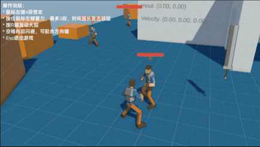
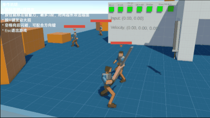
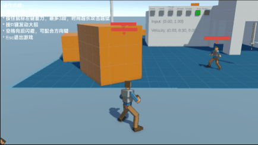

动作游戏战斗原型，基于Unity。

> Demo下载地址：前往本仓库Releases页面下载 `act-demo.7z` ，解压即可体验。

- [基于Timeline的技能编辑器](#基于Timeline定制轨道的技能编辑器)
- [战斗-连招和反馈](#战斗-连招和反馈)
- [RootMotion物理兼容](#RootMotion物理兼容)
- [终结技](#终结技)

---

### 基于Timeline定制轨道的技能编辑器
基于Timeline定制轨道的技能编辑器，方便技能的配置和预览
- 伤害执行轨道
- 指令输入限制轨道

---

### 战斗-连招和反馈
- 玩家预输入缓冲，并在指令可用时按优先级读取输入指令，保证手感稳定流畅。
- 自动锁定附近敌人并在攻击时朝向敌人
- 连招搭配多种类型的角色受击反馈，**强化打击感**
- 基于[自制GAS](#GAS-in-Unity)的攻击伤害附加火焰点燃

---

### RootMotion物理兼容
代码拦截获取 `Animator` 的 RootMotion 动画位移，并驱动 `CharacterController.Move` ，实现动画位移和物理的兼容

---

### 终结技
综合编排技能的动作表演，相机切换，特效，伤害，点燃，敌方受击反馈整合而成的终结技演出。

