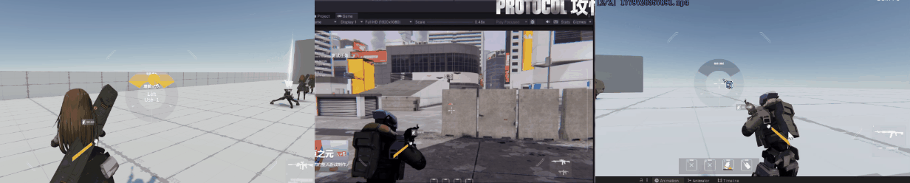

该项目为非商业化的少女前线同人游戏项目，类型为第三人称射击（TPS）。

我负责完成了游戏全部的程序框架，以及绝大多数具体程序功能。（基于Unity），重要贡献包含但不仅限于下面内容：

- [载具和人形角色的混合战场](#载具和人形角色的混合战场)
- [IK射击姿态控制](#ik射击姿态控制)
- [手雷投掷瞄准](#手雷投掷瞄准)
- [节点化关卡配置](#节点化关卡配置)
- [支援面板](#支援面板)

（动态图加载可能需要耐心等待）

---

### 载具和人形角色的混合战场

载具能使用撞击破坏脆弱环境对象。

载具和人形角色有不同的活动区域，人形角色可以躲入室内，载具在追击时会尝试在最近的室外入口攻击。

合理的模型物理层级划分，人形可以从载具模型下的空间穿过，载具可正常在地面移动。

---

### IK射击姿态控制

高级IK绑定结构，支持左手持枪、右手持枪、双手持枪的切换，以及IK控制和动画控制的过渡

---

### 手雷投掷瞄准

基于物理抛物线计算弹道、碰撞点及反弹轨迹，手感对标《全境封锁》。

---

### 节点化关卡配置

基于Unity可视化编程制作的关卡配置节点工具，可快速搭建复杂关卡原型。支持的功能包括：角色生成、获取存活角色、按策略选择生成点、添加头顶标记（玩家引导）、添加互动点、设置AI活动限制区域（引导AI按剧本移动）等等

 

---

### 支援面板

使用统一的轮盘界面，允许配置多种类型的支援功能。
- 易于扩展，统一的模块入口方便从不同的代码注册支援功能
- 参数可选，能够接受位置信息或角色信息，并且可以限制只对敌方或友方触发

下方演示从左到右依次是：
召唤增援队友，指示队友攻击，呼叫空袭打击。

---